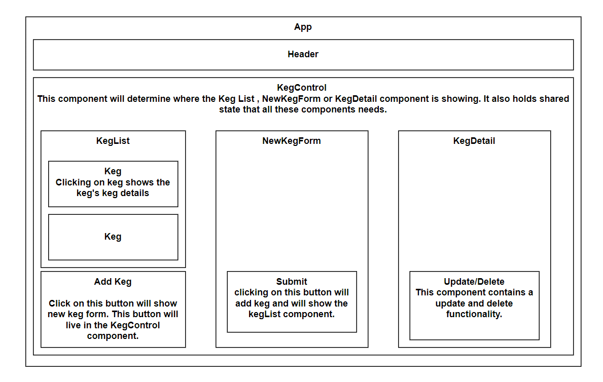

# Tap Room

   React application all CURD functionality for a bar or kombucha store can track their kegs. This could also be a soda fountain or another kind of tracker.

## Name of Authors:

  _Smita Rajpurohit_
  

## Description

This application have the following functionality:

* As a user, I want to see a list/menu of all available kegs. For each keg, I want to see its name, brand, price and alcoholContent (or perhaps something like flavor for a kombucha store).
* As a user, I want to submit a form to add a new keg to a list.
* As a user, I want to be able to click on a keg to see its detail page.
* As a user, I want to see how many pints are left in a keg. Hint: A full keg has roughly 124 pints.
* As a user, I want to be able to click a button next to a keg whenever I sell a pint of it. This should decrease the number of pints left by 1. Pints should not be able to go below 0.
* As a user, I want a keg to update to say "Out of Stock" once it's empty.
* As a user, I want kegs with less than 10 pints to include a message that says "Almost Empty" so I can try a pint before it's gone!

## Technologies used:

1. React.js
2. JavaScript
3. Webpack
4. JSX
5. CSS

## live site

[http://192.168.1.17:3001](http://192.168.1.17:3001)
## Component Daigram

 

## Setup/Installation Requirements

1. Download or clone the [https://github.com/smita-raj12/tap-room](https://github.com/smita-raj12/tap-room) to your local machine.

2. Download any Code Editor for your choice. (Here I used VSCode).

3. Make sure Node has installed if not search it on google and follow the steps of node installation. 

4. Open git BASH terminal and navigate to the tap-room, within the directory
Run `npm install` in the git BASH terminal to install dependencies. 

5. View the website by visiting localhost:3000/ in a new web browser tab (such as google chrome)

## Known bugs

There are no bugs. 

## License information with a copyright and date:

MIT License

Copyright (c) 2021 

Permission is hereby granted, free of charge, to any person obtaining a copy of this software and associated documentation files (the "Software"), to deal in the Software without restriction, including without limitation the rights to use, copy, modify, merge, publish, distribute, sublicense, and/or sell copies of the Software, and to permit persons to whom the Software is furnished to do so, subject to the following conditions:

The above copyright notice and this permission notice shall be included in all copies or substantial portions of the Software.

THE SOFTWARE IS PROVIDED "AS IS", WITHOUT WARRANTY OF ANY KIND, EXPRESS OR IMPLIED, INCLUDING BUT NOT LIMITED TO THE WARRANTIES OF MERCHANTABILITY, FITNESS FOR A PARTICULAR PURPOSE AND NONINFRINGEMENT. IN NO EVENT SHALL THE AUTHORS OR COPYRIGHT HOLDERS BE LIABLE FOR ANY CLAIM, DAMAGES OR OTHER LIABILITY, WHETHER IN AN ACTION OF CONTRACT, TORT OR OTHERWISE, ARISING FROM, OUT OF OR IN CONNECTION WITH THE SOFTWARE OR THE USE OR OTHER DEALINGS IN THE SOFTWARE.

## Contact information:
   
* smita.raj12@gmail.com

